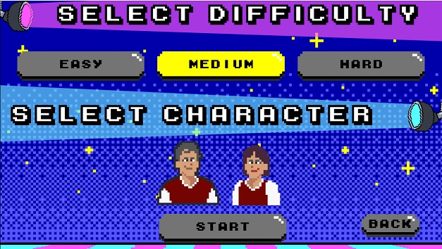

BoogIsko

This is a course requirements for CS191/192 Software Engineering Courses of the Department of Computer Science, College of Engineering, University of the Philippines, Diliman under the guidance of Ma. Rowena C. Solamo for AY 2020-2021.

Members:

CRISOSTOMO, Lhee
CUNANAN, Ridge
JUDAL, Denver
RAZAL, Cassandra

**BoogIsko** is a simple rhythm game where you time arrow key presses to increase your score similar to *Dance Dance Revolution* \(except you don't have to stand up and jump around for this one\). 

**In-game Screenshots:** 
 

 

